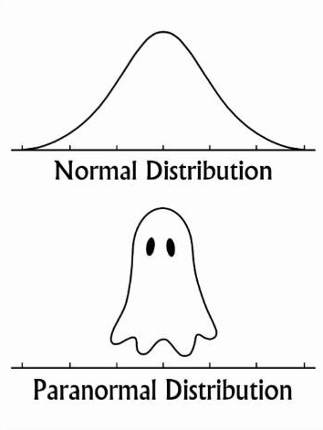

This site contains material for Dr. Johnson's *Survey Sampling Methods* course (Stat 422) at the University of Idaho for the fall semester of 2023.

***

***

If you are interested in the R markdown source code for these web pages, see the [repository](https://github.com/trobinj/stat422/tree/gh-pages). The relevant code is in the files with .Rmd extensions.