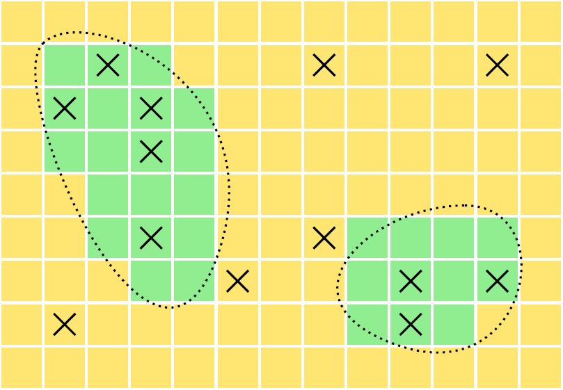

---
output:
  html_document: 
    theme: readable
  pdf_document: default
---

```{r, echo = FALSE, message = FALSE}
library(lubridate)
date <- "09-04-2024"
weekday <- wday(mdy(date), label = TRUE, abbr = FALSE)
month <- month(mdy(date), label = TRUE)
day <- day(mdy(date))
```

---
title: `r paste(weekday, ", ", month, " ", day, sep = "")`
output:
  html_document: 
    theme: readable
  pdf_document: default
urlcolor: blue
header-includes:
  - \usepackage{float}
  - \usepackage{booktabs}
---

```{r setup, include = FALSE}
knitr::opts_chunk$set(echo = FALSE, message = FALSE, out.width = "100%", fig.align = "center", cache = FALSE, dev = ifelse(knitr::is_html_output(), "png", "pdf"))
```

```{r packages}
library(tidyverse)
suppressWarnings(library(kableExtra))
```

```{r utilities}
source("../../utilities.R")
```

`r ifelse(knitr::is_html_output(), paste("You can also download a [PDF](lecture-", date, ".pdf) copy of this lecture.", sep = ""), "")`

## Stratified (Random) Sampling Designs

A **stratified random sampling design** can be described as having two steps.

1. Partition the elements in the population into $L$ sub-populations (strata).

2. Apply a simple random sampling design to *each* stratum. 

Stratified random sampling is a *complex* sampling design, but it uses simple random sampling. How? 

**Example**: Suppose we have a population of $N$ = 5 elements: $\mathcal{P} = \{\mathcal{E}_1,\mathcal{E}_2,\mathcal{E}_3,\mathcal{E}_4,\mathcal{E}_5\}$. For a *simple* random sampling with $n$ = 3 there are 
$$
  \binom{5}{3} = 10
$$
possible samples. The sample space is
\begin{align*}
  \mathcal{S}_1 & = \{\mathcal{E}_1,\mathcal{E}_2,\mathcal{E}_3\}, \\
  \mathcal{S}_2 & = \{\mathcal{E}_1,\mathcal{E}_2,\mathcal{E}_4\}, \checkmark \\
  \mathcal{S}_3 & = \{\mathcal{E}_1,\mathcal{E}_2,\mathcal{E}_5\}, \checkmark \\
  \mathcal{S}_4 & = \{\mathcal{E}_1,\mathcal{E}_3,\mathcal{E}_4\}, \checkmark \\
  \mathcal{S}_5 & = \{\mathcal{E}_1,\mathcal{E}_3,\mathcal{E}_5\}, \checkmark \\
  \mathcal{S}_6 & = \{\mathcal{E}_1,\mathcal{E}_4,\mathcal{E}_5\}, \\
  \mathcal{S}_7 & = \{\mathcal{E}_2,\mathcal{E}_3,\mathcal{E}_4\}, \checkmark \\
  \mathcal{S}_8 & = \{\mathcal{E}_2,\mathcal{E}_3,\mathcal{E}_5\}, \checkmark \\
  \mathcal{S}_9 & = \{\mathcal{E}_2,\mathcal{E}_4,\mathcal{E}_5\}, \\
  \mathcal{S}_{10} & = \{\mathcal{E}_3,\mathcal{E}_4,\mathcal{E}_5\}.
\end{align*}
But suppose we divide these elements in the population into $L$ = 2 strata, defined as 
\begin{align*}
  \mathcal{P}_1 & = \{\mathcal{E}_1,\mathcal{E}_2,\mathcal{E}_3\}, \\
  \mathcal{P}_2 & = \{\mathcal{E}_4,\mathcal{E}_5\}.
\end{align*}
So $N_1$ = 3 and $N_2$ = 2. For a stratified random sampling design with sample sizes of $n_1$ = 2 and $n_2$ = 1 (the same total number of elements sampled as in the simple random sampling design) there are
$$
  \binom{3}{2} \times \binom{2}{1} = 6
$$
possible samples (marked above with a $\checkmark$). Note that stratified sampling is more *restrictive*. The sample space of a stratified random sampling design is a subset of that of a simple random sampling design with the same $n$. Certain samples that are possible under simple random sampling are not possible under stratified random sampling, and that's (usually) a good thing!

Why use a stratified (rather than simple) random sampling design?

1. Administrative convenience.

0. Greater control over cost. 

0. Interest in specific domains. 

0. More representative samples.

## Properties of a Stratified Random Sampling Design

1. Let $N_j$ be the number of elements in the $j$-th stratum, and let $n_j$ be the number of elements sampled from the $j$-th stratum. The number of possible samples is
$$
  \binom{N_1}{n_1} \times \binom{N_2}{n_2} \times \cdots \times \binom{N_L}{n_L}.
$$
This is *less* than the number of possible samples under simple random sampling when applied to the same population with the same (total) sample size of $n = n_1 + n_2 + \dots + n_L$.

2. Each sample in the sample space has a probability of 
$$
  \frac{1}{\binom{N_1}{n_1} \times \binom{N_2}{n_2} \times \cdots \times \binom{N_L}{n_L}}.
$$
So like simple random sampling every possible sample is equally likely, but in stratified random sampling the set of possible samples (i.e., the sample space) is smaller.

3. The inclusion probability of an element *depends on its stratum*. If the $i$-th element is in the $j$-th stratum, then its inclusion probability is $n_j/N_j$. 

\pagebreak

## Data and Notation for Stratified Random Sampling

**Example**: The following data are from a [survey of sword fern](swordfern.png) that used a stratified random sampling design. The target variable is biomass of sword fern (grams per square meter).

<center>



</center>

```{r}
d <- data.frame(Stratum = 1:2, Region = c("Forest","Prairie"), Nj = c(30,87), nj = c(8,5),
  mj = c(287,11.3), sj = c(149.1,16.8))
d$Region <- as.character(d$Region)
d <- rbind(d, c("","",117,13,"",""))
names(d)[3:6] <- c("$N_j$","$n_j$","$\\bar{y}_j$","$s_j$")
ktbl(d)
```
Note that we have $L$ = 2 strata, a total population size of $N$ = 117, and a total sample size of $n$ = 13.

**Example**: The following data are from the 1988 National Maternal and Infant Health Survey. This survey used a stratified random sampling design. The target variable is mother's age. 
```{r}
d <- expand.grid(Race = c("$\\text{AA}$","$\\overline{\\text{AA}}$"), Weight = c("small","medium","large"))
d <- d %>% arrange(Race, Weight) %>% mutate(Stratum = 1:6) %>% mutate(Race = as.character(Race), Weight = as.character(Weight))
d$Nj <- c(18130,65670,559124,27550,150080,2944800)
d$nj <- c(1285,1194,4948,950,938,4090)
d$yj <- c(24.64,24.42,24.41,26.44,26.11,26.70)
d$sj <- c(5.84,5.76,5.68,5.88,5.85,5.45)
d <- d %>% select(Stratum, Race, Weight, everything())
d <- rbind(d, c("","","", sum(d$Nj), sum(d$nj), "", ""))
names(d)[4:7] <- c("$N_j$","$n_j$","$\\bar{y}_j$","$s_j$")
ktbl(d)
```
Note that we have $L$ = 6 strata, a total population size of $N$ = 3765354, and a total sample size of $n$ = 13405. Also note that strata can be defined in terms of *combinations* of two or more variables (e.g., race and birth weight). 

\pagebreak

## Estimators of $\mu$ and $\tau$

The mean of *all* elements in the population (i.e., all strata combined) can be written as
$$
  \mu = \frac{N_1}{N}\mu_1 + \frac{N_2}{N}\mu_2 + \cdots + \frac{N_L}{N}\mu_L = \sum_{j=1}^L \frac{N_j}{N}\mu_j,
$$
where $\mu_j$ be the mean of the target variable for the $N_j$ elements in the $j$-th stratum. Since we can estimate $\mu_j$ with $\bar{y}_j$, this suggests we use the estimator
$$
  \hat\mu = \frac{N_1}{N}\bar{y}_1 + \frac{N_2}{N}\bar{y}_2 + \cdots + \frac{N_L}{N}\bar{y}_L = \sum_{j=1}^L \frac{N_j}{N}\bar{y}_j
$$
to estimate $\mu$. Note that we can also write this as
$$
  \hat\mu = \frac{1}{N}\sum_{j=1}^L N_j\bar{y}_j.
$$

**Example**: What are the estimates of $\mu$ for the two surveys given earlier?

\pagebreak

Recall that $\tau = N\mu$, so using the expression for $\mu$ above we can write $\tau$ as
$$
  \tau = N_1\mu_1 + N_2\mu_2 + \cdots + N_L\mu_L = \sum_{j=1}^LN_j\mu_j.
$$
This suggests the estimator 
$$
  \hat\tau = N_1\bar{y}_1 + N_2\bar{y}_2 + \cdots + N_L\bar{y}_L = \sum_{i=1}^LN_j\bar{y}_j
$$
to estimate $\tau$. Alternatively we could write this as $\hat\tau = \hat\tau_1 + \hat\tau_2 + \cdots + \hat\tau_L$ where $\hat\tau_j = N_j\bar{y}_j$ is the estimator we used for simple random sampling. 

**Example**: What is the estimate of $\tau$ for the sword fern survey?

\pagebreak

## Estimator Sampling Distributions

Both estimators are *unbiased* under stratified random sampling, and the shape of the sampling distributions are approximately normal by the central limit theorem. But the *variances* of these estimators **are not ** generally the same as those for the estimators under simple random sampling. 

The variance of $\hat\mu$ is
$$
	V(\hat\mu) = 
  \left(\frac{N_1}{N}\right)^2 V(\bar{y}_1) + 
	\left(\frac{N_2}{N}\right)^2 V(\bar{y}_2) + \cdots + 
	\left(\frac{N_L}{N}\right)^2 V(\bar{y}_L),
$$
where 
$$
  V(\bar{y}_j) = \left(1 - \frac{n_j}{N_j}\right)\frac{\sigma_j^2}{n_j},
$$
and $\sigma_j^2$ is defined here as the variance of all elements in the $j$-th stratum. We can also write the variance of $\hat\mu$ as
$$
  V(\hat\mu) = \frac{1}{N^2}\sum_{j=1}^L N_j^2\left(1 - \frac{n_j}{N_j}\right)\frac{\sigma_j^2}{n_j}.
$$
If the $\sigma_j^2$ are unknown then they can be replaced with the $s_j^2$ to produce an estimated variance of $\hat\mu$. 

**Example**: What is the estimated variance of the estimator of $\mu$ based on the sword fern survey? What is the (estimated) bound on the error of estimation?

\pagebreak

The variance of $\hat\tau$ is
$$
	V(\hat\tau) = 
  V(\hat\tau_1) + 
	V(\hat\tau_2) + \cdots + 
	V(\hat\tau_L),
$$
where 
$$
  V(\hat\tau_j) = N_j^2\left(1 - \frac{n_j}{N_j}\right)\frac{\sigma_j^2}{n_j},
$$
and $\sigma_j^2$ is defined here as the variance of all elements in the $j$-th stratum. We can also write the variance of $\hat\tau$ as
$$
  V(\hat\tau) = \sum_{j=1}^L N_j^2\left(1 - \frac{n_j}{N_j}\right)\frac{\sigma_j^2}{n_j}.
$$
If the $\sigma_j^2$ are unknown then they can be replaced with the $s_j^2$ to produce an estimated variance of $\hat\mu$. 

**Example**: What is the estimated variance of the estimator of $\tau$ based on the sword fern survey? What is the (estimated) bound on the error of estimation?

\vspace{8cm}

Note: $V(\hat\mu)$ and $V(\hat\tau)$ are related because $V(\hat\tau) = N^2V(\hat\mu)$.

Note: Standard errors, bounds on the error of estimation, and confidence intervals for estimating $\mu$ and $\tau$ under stratified random sampling are computed in the same way as they were under simple random sampling, just with a different variance expression.

## Design Considerations

There are two types of decisions to be made when designing a stratified random sampling design.

1. *Stratification*. How should the elements be partitioned into strata?

0. *Allocation*. How should the total sample size be distributed over the $L$ strata?
