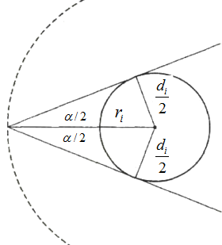

---
output:
  html_document: 
    theme: readable
  pdf_document: default
---

```{r, echo = FALSE, message = FALSE}
library(lubridate)
date <- "11-16-2022"
weekday <- wday(mdy(date), label = TRUE, abbr = FALSE)
month <- month(mdy(date), label = TRUE)
day <- day(mdy(date))
```

---
title: `r paste(weekday, ", ", month, " ", day, sep = "")`
output:
  html_document: 
    theme: readable
  pdf_document: default
header-includes:
  - \usepackage{float}
  - \usepackage{booktabs}
---

```{r setup, include = FALSE}
knitr::opts_chunk$set(echo = FALSE, message = FALSE, out.width = "100%", fig.align = "center", comment = "", cache = FALSE, dev = ifelse(knitr::is_html_output(), "png", "pdf"))
```

```{r packages, echo = FALSE}
library(tidyverse)
suppressWarnings(library(kableExtra))
```

```{r utilities, echo = FALSE}
source("../../utilities.R")
```

`r ifelse(knitr::is_html_output(), paste("You can also download a [PDF](lecture-", date, ".pdf) copy of this lecture.", sep = ""), "")`

<!-- Note: Had to drop/condense lectures here due to classes being canceled. -->

## Line-Intercept Sampling

A sample of elements in a region are selected according to the following procedure.

1. Select a random point within the region based on a uniform distribution. Extend a transect line from that point in a given direction such that it crosses the whole region.

0. Select all objects that are intercepted by the transect line. 

This process can be repeated. 

**Example**: Consider the line-intercept survey with four transect lines.

```{r, fig.height = 5}
library(shape)

set.seed(125)

par(mai = c(0.1,0.1,0.1,0.1))

emptyplot(c(0, 100), c(0, 50), frame.plot = FALSE)

for (i in seq(0, 100, by = 5)) {
  lines(c(i,i), c(0,50), lty = 2, col = grey(0.8))
}
for (i in seq(0, 50, by = 5)) {
  lines(c(0, 100), c(i, i), lty = 2, col = grey(0.8))
}

rect <- function(mid, w) {
  x <- mid[1]
  y <- mid[2]
  lines(c(x - w/2, x + w/2), c(y - w/2, y - w/2))
  lines(c(x - w/2, x + w/2), c(y + w/2, y + w/2))
  lines(c(x - w/2, x - w/2), c(y - w/2, y + w/2))
  lines(c(x + w/2, x + w/2), c(y - w/2, y + w/2))
}

n.small <- 10
n.large <- 10

x.small <- rep(1, n.small)
y.small <- rep(1, n.small)
x.large <- rep(1, n.large)
y.large <- rep(1, n.large)

dcheck <- function(x.small, y.small, x.large, y.large, n.small, n.large) {
  d <- as.matrix(dist(cbind(c(x.small, x.large), c(y.small, y.large)), upper = TRUE))
  d.small <- d[1:n.small, 1:n.small]
  d.large <- d[(n.small + 1):(n.small + n.large), (n.small + 1):(n.small + n.large)]
  d.cross <- d[(n.small + 1):(n.small + n.large), 1:n.small]
  d.small <- min(d.small[lower.tri(d.small, diag = FALSE)])
  d.large <- min(d.large[lower.tri(d.large, diag = FALSE)])
  d.cross <- min(d.cross)
  return(any(d.small < 5, d.large < 10, d.cross < 10))
}

while (dcheck(x.small, y.small, x.large, y.large, n.small, n.large)) {
  x.small <- sample(seq(2.5, 97.5, by = 5), n.small, replace = TRUE)
  y.small <- sample(seq(2.5, 47.5, by = 5), n.small, replace = TRUE)
  x.large <- sample(seq(5, 95, by = 5), n.large, replace = TRUE)
  y.large <- sample(seq(5, 45, by = 5), n.large, replace = TRUE)
}

for (i in 1:n.small) {
  plotellipse(2.5, 2.5, c(x.small[i], y.small[i]), lwd = 1)
  text(x.small[i], y.small[i], rpois(1, 5) + 1)
}
for (i in 1:n.large) {
  plotellipse(5, 5, c(x.large[i], y.large[i]), lwd = 1)
  text(x.large[i], y.large[i], rpois(1, 10) + 1)
}

abline(v = c(11, 22, 72, 84))
```
Consider the sample of objects intercept by *one line*. The inclusion probability of the $i$-th object is $\pi_i = w_i/W$, where $w_i$ is the horizontal width of the object and $W$ is the total width of the region. An estimator of $\tau$ based on a given line is the Horvitz-Thompson estimator
$$
  \hat\tau = \sum_{i \in \mathcal{S}} \frac{y_i}{\pi_i} = W\sum_{i \in \mathcal{S}} \frac{y_i}{w_i}.
$$
**Example**: Based on the example shown above, what are the estimates of $\tau$ based on the three lines that intercept objects? The value of the target variable is shown within each object.

\pagebreak

Let $\hat\tau_k$ be the estimate of $\tau$ based on the $k$-th non-empty line. An estimate of $\tau$ can be obtained by averaging $K$ transect line estimates to get
$$
  \hat\tau = \frac{1}{K}\sum_{k=1}^K \hat\tau_k.
$$
The estimated variance of $\hat\tau$ is then
$$
  \hat{V}(\hat\tau) = \frac{1}{K(K-1)}\sum_{k=1}^K(\hat\tau_k - \hat\tau)^2.
$$

**Example**: What is the estimate of $\tau$ based on the survey given earlier?

\pagebreak

Another estimator is to use a Horvitz-Thompson estimator based on the sample of elements intersected by the $n$ transect lines. Then the Horvitz-Thompson estimator is
$$
  \hat\tau = \sum_{i \in \mathcal{S}}\frac{y_i}{\pi_i},
$$
where $\pi_i = 1 - (1 - w_i/W)^t$, since we are sampling with replacement and $w_i/W$ is the selection probability of the $i$-th element. Calculation of the estimated variance of this estimator requires the second-order (joint) inclusion probabilities, which can be computed as
$$
  \pi_{ij} = \pi_i + \pi_j - 1 + \left(1 - \frac{w_i + w_j - w_{ij}}{W}\right)^t,
$$
where $w_{ij}/W$ is the probability that objects $i$ and $j$ would both be intersected by a line. 

## Fixed Area Plot Sampling

A sample of objects in a region are selected according to the following procedure.

1. Select a random point within the region based on a uniform distribution.

0. Select all objects that are within a plot of a given shape (e.g., circle, square, or rectangle) centered on that point.  

This process can be repeated.

**Example**: Consider the following fixed area plot survey with three circular fixed area plots.

```{r, fig.height = 3.75}
library(shape)
set.seed(101)

overlap <- function(xbox, ybox, mid, rad, n = 1e4) {
  # computes area of circle that overlaps with a box
  rho <- sqrt(runif(n))
  ang <- runif(n, 0, 2*pi)
  x <- rho * cos(ang) * rad + mid[1]
  y <- rho * sin(ang) * rad + mid[2]
  return(pi * rad^2 * mean((x > xbox[1]) * (x < xbox[2]) * (y > ybox[1]) * (y < ybox[2])))
}

N <- 200
n <- 3

xrng <- c(0,100)
yrng <- c(0,50)

rad <- 5

plotcirc <- FALSE

par(mai = c(0,0,0,0))

data <- data.frame(x.tree = runif(N, xrng[1], xrng[2]), 
  y.tree = runif(N, yrng[1], yrng[2]), volume = round(runif(N, 10, 70), 1))
with(data, plot(x.tree, y.tree, xlab = "", ylab = "", yaxt = "n", xaxt = "n", bty = "n"))
polygon(c(xrng[1], xrng[2], xrng[2], xrng[1]), c(yrng[1], yrng[1], yrng[2], yrng[2]))

samp <- data.frame(x.samp = c(3, 42, 85), y.samp = c(39, 22, 47.5))

for (i in 1:nrow(samp)) {
  with(samp, plotellipse(rx = rad, ry = rad, mid = c(x.samp[i], y.samp[i]), lwd = 1))
  with(samp, points(x.samp[i], y.samp[i], pch = 3))
}

t <- 1

a <- NULL
v <- NULL
i.indx <- NULL
j.indx <- NULL

for (i in 1:n) {
  for (j in 1:N) {
     if (sqrt((data$x.tree[j] - samp$x.samp[i])^2 + (data$y.tree[j] - samp$y.samp[i])^2) < rad) {
       if (plotcirc) with(data, plotellipse(rx = rad, ry = rad, mid = c(x.tree[j], y.tree[j]), lwd = 1, lty = 2 ))
       with(data, points(x.tree[j], y.tree[j], pch = 16))
       v <- c(v, data$volume[j])
       h <- ifelse(rad > data$x.tree[j], rad - data$x.tree[j], 0)
       a <- c(a, overlap(xrng, yrng, c(data$x.tree[j], data$y.tree[j]), rad))
       i.indx <- c(i.indx, i)
       j.indx <- c(j.indx, j)
     }
  }
}

data <- data.frame(i = i.indx, j = j.indx, volume = v, area = a)
for (i in 1:max(i.indx)) {
  data$j[data$i == i] <- rank(data$j[data$i == i])
}
data$area <- round(data$area, 1)

A <- (xrng[2]-xrng[1]) * (yrng[2]-yrng[1])
a <- rad
```

The probability that an object will be included within a plot equals the area of the plot that is also within the region when the center of the plot is centered on the object.

```{r, fig.height = 3.75}
set.seed(101)

overlap <- function(xbox, ybox, mid, rad, n = 1e4) {
  # computes area of circle that overlaps with a box
  rho <- sqrt(runif(n))
  ang <- runif(n, 0, 2*pi)
  x <- rho * cos(ang) * rad + mid[1]
  y <- rho * sin(ang) * rad + mid[2]
  return(pi * rad^2 * mean((x > xbox[1]) * (x < xbox[2]) * (y > ybox[1]) * (y < ybox[2])))
}

N <- 200
n <- 3

xrng <- c(0,100)
yrng <- c(0,50)

rad <- 5

plotcirc <- TRUE

par(mai = c(0,0,0,0))

data <- data.frame(x.tree = runif(N, xrng[1], xrng[2]), 
  y.tree = runif(N, yrng[1], yrng[2]), volume = round(runif(N, 10, 70), 1))
with(data, plot(x.tree, y.tree, xlab = "", ylab = "", yaxt = "n", xaxt = "n", bty = "n"))
polygon(c(xrng[1], xrng[2], xrng[2], xrng[1]), c(yrng[1], yrng[1], yrng[2], yrng[2]))

samp <- data.frame(x.samp = c(3, 42, 85), y.samp = c(39, 22, 47.5))

for (i in 1:nrow(samp)) {
  with(samp, plotellipse(rx = rad, ry = rad, mid = c(x.samp[i], y.samp[i]), lwd = 1))
  with(samp, points(x.samp[i], y.samp[i], pch = 3))
}

t <- 1

a <- NULL
v <- NULL
i.indx <- NULL
j.indx <- NULL

for (i in 1:n) {
  for (j in 1:N) {
     if (sqrt((data$x.tree[j] - samp$x.samp[i])^2 + (data$y.tree[j] - samp$y.samp[i])^2) < rad) {
       if (plotcirc) with(data, plotellipse(rx = rad, ry = rad, mid = c(x.tree[j], y.tree[j]), lwd = 1, lty = 2))
       with(data, points(x.tree[j], y.tree[j], pch = 16))
       v <- c(v, data$volume[j])
       h <- ifelse(rad > data$x.tree[j], rad - data$x.tree[j], 0)
       a <- c(a, overlap(xrng, yrng, c(data$x.tree[j], data$y.tree[j]), rad))
       i.indx <- c(i.indx, i)
       j.indx <- c(j.indx, j)
     }
  }
}

data <- data.frame(i = i.indx, j = j.indx, volume = v, area = a)
for (i in 1:max(i.indx)) {
  data$j[data$i == i] <- rank(data$j[data$i == i])
}
data$area <- round(data$area, 1)
data$j <- NULL

A <- (xrng[2] - xrng[1]) * (yrng[2] - yrng[1])
a <- rad
```

For a given plot the Horvitz-Thompson estimator of $\tau$ is
$$
  \sum_{i \in \mathcal{S}}\frac{y_{i}}{\pi_{i}} = A\sum_{i \in \mathcal{S}}\frac{y_{i}}{a_{i}},
$$
because $\pi_i = a_i/A$ where $A$ is the total area of the region and $a_i$ is the area of the plot that is also withiin the region when the plot is centered on the $i$-th object.

An estimator of $\tau$ can be obtained by averaging these estimates. Let $\hat\tau_k$ be the estimate from the $k$-th non-empty plot. If there are $K$ non-empty plots then the estimator of $\tau$ is
$$
  \hat\tau = \frac{1}{K}\sum_{k=1}^K \hat\tau_k.
$$
The estimated variance of $\hat\tau$ is 
$$
  \hat{V}(\hat\tau) = \frac{1}{K(K-1)}\sum_{k=1}^K (\hat\tau_k - \hat\tau)^2.
$$

**Example**: Assume a region with a total area of 5000 meters and $K$ = 3 non-empty circular plots.
```{r}
names(data) <- c("$k$","$y_i$","$a_i$")
ktbl(data)
```

\pagebreak

## Bitterlich Sampling

A sample of trees is selected according to the following procedure.

1. Select a random point within a region based on a uniform distribution.

0. Select all trees with trunk diameters that exceed a critical angle ($\alpha$) when viewed from that point. 

<center>



</center>

Also see Figure 2 in [this paper](http://pommerening.org/wiki/images/e/ec/SamplingMeasuresOfTreeDiversity.pdf).

Let $\alpha$ be the critical angle and $d_i$ by the diameter of the $i$-th tree. Then the radius ($r_i$) of a circle that encloses all points that would result in the selection of the $i$-th tree is 
$$
  r_i = \frac{d_i}{2\sin(\alpha/2)}.
$$
Thus the $i$-th tree is selected if and only if
$$
  \text{distance to center of the $i$-th tree} \le \frac{d_i}{2\sin(\alpha/2)},
$$
assuming that this circle does not extend outside the region. The inclusion probability of the $i$-th tree is the probability of this happening. The area of this circle is $a_i = \pi r_i^2$ which can be computed as
$$
  a_i = \frac{\pi d_i^2}{4\sin^2(\alpha/2)}.
$$
Note that $\pi$ here is the mathematical constant $\pi$ $\approx$ 3.14, *not* the inclusion probability of the tree. The inclusion probability of the $i$-th tree is 
$$
  \pi_i = a_i/A,
$$
where $A$ is the total area of the region in which the point was sampled. If there are $n$ selected trees, then the estimate of $\tau$ for some target variable $y_i$ is 
$$
  \hat\tau = \sum_{i \in \mathcal{S}}\frac{y_i}{\pi_i}.
$$

### Variations on Bitterlich Sampling

1. If $y_i$ is the *basal area* of the $i$-th tree so that $y_i = \pi d_i^2/4$, then
$$
  \hat\tau = \sum_{i \in \mathcal{S}} \frac{y_i}{\pi_i} = nA \sin^2(\alpha/2),
$$
where $n$ is the number of selected trees, so that the estimated total basal area is proportional to the number of selected trees. 

2. As in the previous examples if we have $K$ estimates of $\tau$ (based on as many points) then these can be averaged to come up with one estimate. In the case of estimating total basal area, this estimator becomes
$$
  \hat\tau = \frac{A\sin^2(\alpha/2)}{K}\sum_{k=1}^K n_k,
$$
so that $\hat\tau$ is proportional to the average number of trees selected.