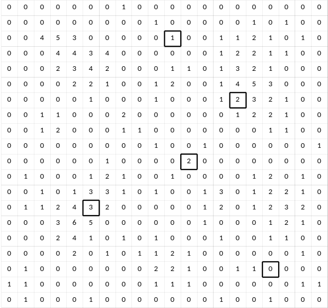
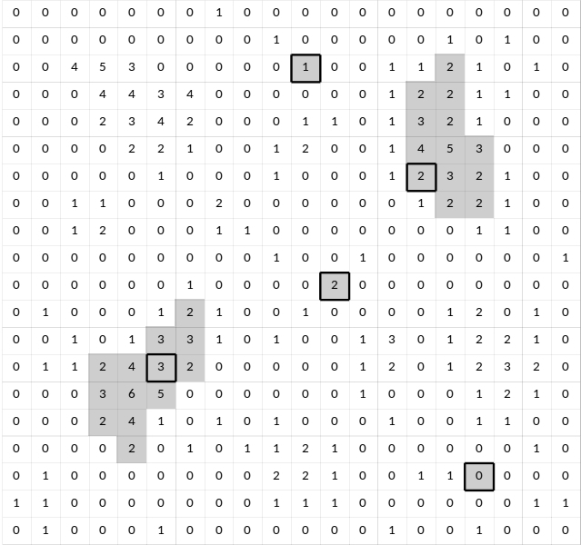
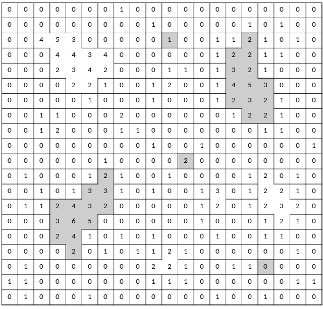
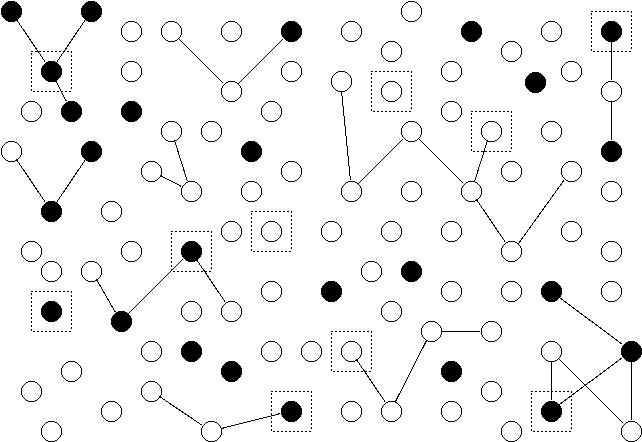
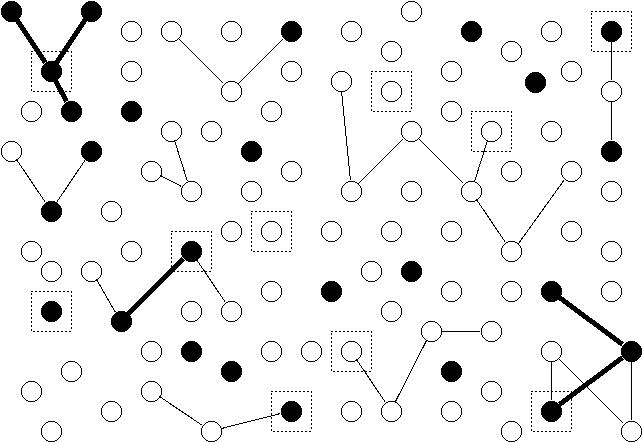

---
output:
  html_document: 
    theme: readable
  pdf_document: default
---

```{r, echo = FALSE, message = FALSE}
library(lubridate)
date <- "11-18-2022"
weekday <- wday(mdy(date), label = TRUE, abbr = FALSE)
month <- month(mdy(date), label = TRUE)
day <- day(mdy(date))
```

---
title: `r paste(weekday, ", ", month, " ", day, sep = "")`
output:
  html_document: 
    theme: readable
  pdf_document: default
header-includes:
  - \usepackage{float}
  - \usepackage{booktabs}
---

```{r setup, include = FALSE}
knitr::opts_chunk$set(echo = FALSE, message = FALSE, out.width = "100%", fig.align = "center", comment = "", cache = FALSE, dev = ifelse(knitr::is_html_output(), "png", "pdf"))
```

```{r packages, echo = FALSE}
library(tidyverse)
suppressWarnings(library(kableExtra))
```

```{r utilities, echo = FALSE}
source("../../utilities.R")
```

`r ifelse(knitr::is_html_output(), paste("You can also download a [PDF](lecture-", date, ".pdf) copy of this lecture.", sep = ""), "")`

<!-- Note: Had to drop/condense lectures here due to classes being canceled. Moved the discussion of weights to after the third examination. -->


## Adaptive Cluster Sampling

An adaptive cluster sampling design involves two steps. 

1. An initial sample of elements is selected according to some sort of sampling design.

0. Any elements within a defined "neighborhood" of the initial sample of elements are also selected if the elements pass a "selection rule" defined in terms of the target variable. This process continues recursively until no elements within the neighborhood of any selected elements pass the selection rule. 

If elements with similar target variable values tend to fall into neighborhoods (i.e., tend to be "clustered"), estimators will tend to have lower variance in comparison to a design that would only uses a random sample of as many initial units. 

**Example**: The following image shows a region that has been divided into 400 squares (elements). The value of the target variable for each is shown as a number. The 5 outlined squares were selected using simple random sampling.

<center>



</center>

Now we apply adaptive sampling using the following protocol.

1. Neighborhoods are defined as the four squares immediately above, below, left, and right of a selected square.
0. The selection rule is $y_i \ge 2$.

The final selected elements are shown below in grey. 

<center>



</center>

These form clusters or *networks* of sampled elements. 

The squares within the region are divided into many networks based on the protocol defined above. All possible networks are shown below, each outlined by a black border. The networks in grey are those that were selected.

Note: Networks exclude "edge units" --- i.e., those elements within the neighborhood of a selected element but that do not pass the selection rule. The reason is that it is not generally possible to compute the inclusion probabilities for edge units.

<center>



</center>

The inclusion probability of any one square/element is equal to the probability that its network would be included. If the size of the network of the $i$-th element is $m_i$, then this can be computed as 
$$
  \pi_i = 1 - \left. \binom{N-m_i}{n} \right/ \binom{N}{n},
$$
where $N$ is the total number of elements, $n$ is the number of element sampled in the *initial* sample, and $m_i$ is the number of elements within the network of the $i$-th element. 

For the three networks of size $m_i = 1$, the inclusion probabilities of the elements are
$$
  \pi_i = 1 - \left. \binom{400 - 1}{5} \right/ \binom{400}{5} = `r 1 - choose(399,5)/choose(400,5)`.
$$
The other two networks each have $m_i$ = 13 elements, so the inclusion probabilities for each of the elements in those networks is
$$
  \pi_i = 1 - \left. \binom{400 - 13}{5} \right/ \binom{400}{5} \approx `r round(1 - choose(400-13,5)/choose(400,5), 4)`.
$$
So we would could compute $\hat\tau$ as
$$
  \hat\tau = \frac{1}{0.0125} + \frac{2}{0.0125} + \frac{0}{0.0125} + \frac{2+3+\cdots+2}{0.153...} + \frac{2+2+\cdots+2}{0.153...}.
$$
This is sometimes called a *modified* Horvitz-Thompson estimator because edge units, although observed, are not considered selected for the purpose of computing the estimator unless they were selected as part of the initial sample. 

**Example**: Suppose we have 100 elements (represented by nodes/points) and we wish to estimate the number of elements with a particular characteristic (represented as filled nodes). Some elements are in networks of two or more elements as represented by edges (lines) between them. An initial sample of 10 elements is selected using simple random sampling. These are represented as nodes surrounded by boxes.

<center>



</center>

Now we apply adaptive sampling using the following protocol.

1. Neighborhoods are defined as any connected notes to the selected node (i.e., there must be an edge/line between the nodes).
0. The selection rule is that the node must have the characteristic (i.e., $y_i = 1$ if we let $y_i$ indicate whether or not the $i$-th element has the characteristic).

The figure below shows the selected networks. Each network is either a single node within a box, or all nodes connected by a thick edge to a node in a box.

<center>



</center>

The estimator of the number of elements with the characteristic is
$$
  \hat\tau = \sum_{i \in \mathcal{S}} \frac{y_i}{\pi_i},
$$
where $y_i$ = 1 (if the element has the characteristic) or $y_i$ = 0 (if the element does not have the characteristic). The inclusion probabilities are
$$
  \pi_i = 1 - \left. \binom{100 - m_i}{10} \right/ \binom{100}{10},
$$
where $m_i$ is the number of elements/nodes within the network of the $i$-th element/node. In this example $m_i$ is 1, 2, 3, or 4, which yield inclusion probabilities of approximately `r vecprnt(round(1 - choose(100 - c(1,2,3,4),10)/choose(100,10),4))`, respectively. 

